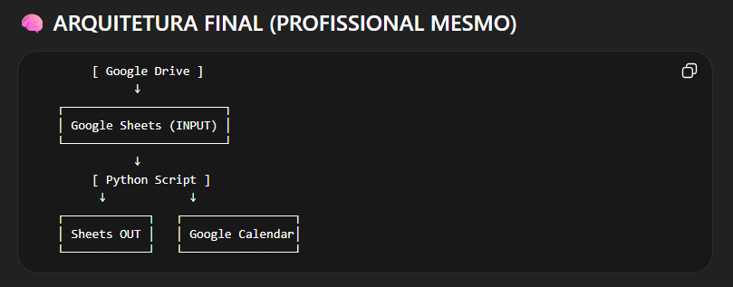

# ProjetoBMSL-Automa-o-Cria-o_planilha_mensal

## Objetivo

A automação tem o objetivo de ler um arquivo do Google Sheets e com base nele criar uma planilha excel mensal e criar eventos no Google calendar recorrentes com base na data e na hora.

## Arquitetura
